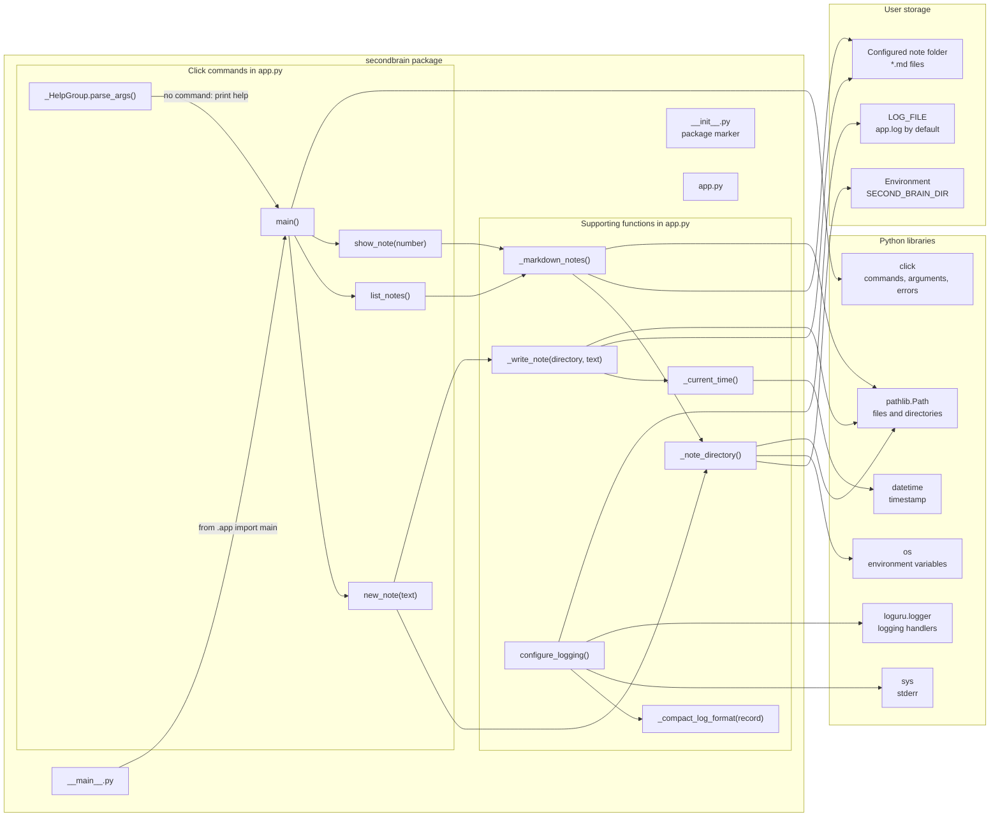
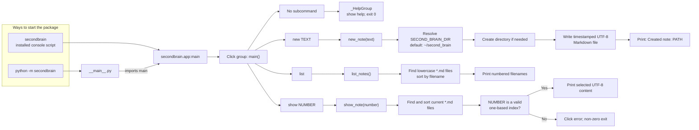

# Flowcharts

These diagrams describe the package structure, command-line interface, and a
typical note-taking workflow.

## Package overview

`configure_logging()` is available for callers to configure Loguru, but the
current CLI entry points do not call it themselves.

## CLI entry points and commands

## Example user flow

```mermaid
flowchart LR
    Start(["User has an idea"]) --> Create["Run:<br/>secondbrain new 'Buy milk'"]
    Create --> Configured{"SECOND_BRAIN_DIR<br/>configured?"}
    Configured -->|"No"| DefaultDir["Use ~/second_brain"]
    Configured -->|"Yes"| CustomDir["Use configured folder"]
    DefaultDir --> Ensure["Create folder if missing"]
    CustomDir --> Ensure
    Ensure --> Saved["Save a timestamped<br/>.md note"]
    Saved --> Confirm["See created file path"]

    Confirm --> Review["Later, run:<br/>secondbrain list"]
    Review --> Results{"Notes found?"}
    Results -->|"No"| Empty["See folder path only"]
    Results -->|"Yes"| Choose["Read a number from the list"]
    Choose --> Open["Run:<br/>secondbrain show 1"]
    Open --> Valid{"Number still valid?"}
    Valid -->|"Yes"| Read["Read note text in terminal"]
    Valid -->|"No"| Retry["See error, then list again"]
    Retry --> Review
```

